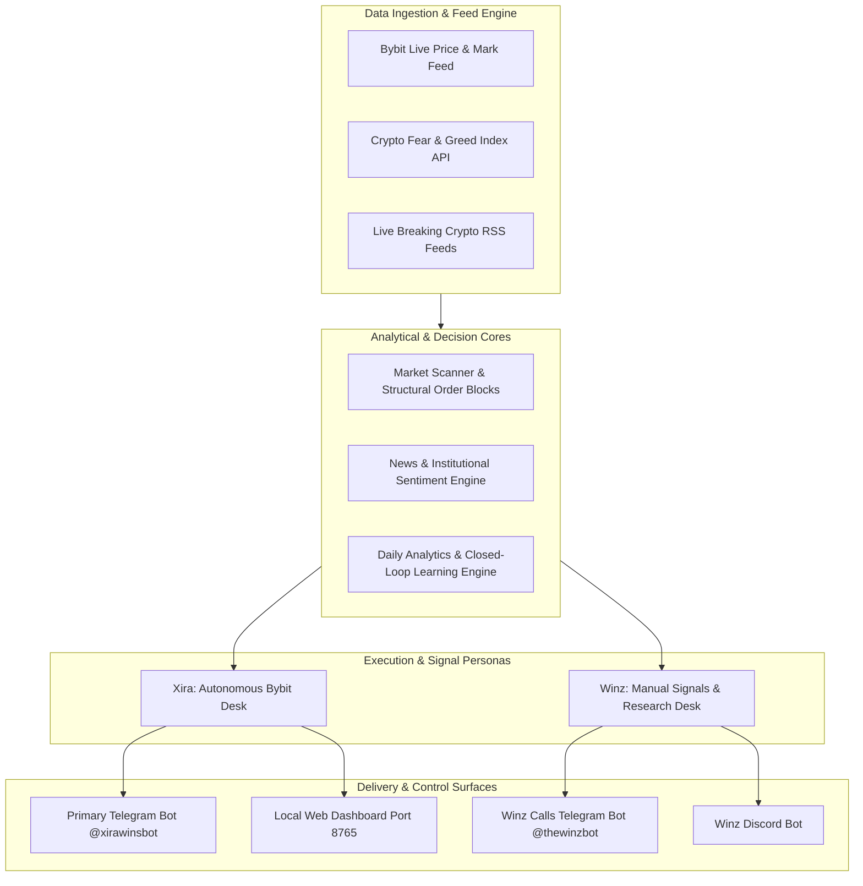

# XIRA TRADING ECOSYSTEM — COMPREHENSIVE ARCHITECTURE & CAPABILITIES MANUAL

---

## 1. Executive Overview

**Xira** is an enterprise-grade, institutional algorithmic trading desk and market intelligence infrastructure built for cryptocurrency markets. Operating 24/7 across perpetual futures and spot venues, Xira bridges systematic algorithmic automation with human-executable manual research.

The ecosystem functions across two distinct operational personas:
1. **Xira Automated Execution Desk**: A fully autonomous algorithmic execution engine directly connected to Bybit (via Demo or Live unified accounts) that discovers liquidity imbalances, places non-market limit accumulation orders, manages dynamic bracket exits (TP/SL), and enforces strict risk controls and self-healing circuit breakers.
2. **Winz Manual Trade Desk**: A dedicated signal generation and research service designed for manual execution on external exchanges. Winz generates 15 curated hourly trade setups (6 scalps, 4 day trades, and 5 spot accumulation plays), delivers technical chart markup on demand, monitors milestone alerts in real-time, and broadcasts across Telegram channels/groups and Discord servers.

---

## 2. System Architecture & Dual Operational Model

---

## 3. Core Capabilities Breakdown

### A. Autonomous Algorithmic Execution (Xira on Bybit)
* **Market Universe**: Continuously scans the **Core 24** high-volume crypto perpetual pairs (BTC, ETH, SOL, XRP, SUI, DOGE, ADA, AVAX, LINK, etc.) plus user-configured **Extra Tickers**.
* **Limit Order Entry Protocol**: Eliminates market-order slippage by placing passive post-only limit orders inside identified order-book shelves (liquidity blocks).
* **Automated Dual-Venue Execution**:
  * **Linear Perpetuals**: Trades both Long and Short directions with isolated margin and asset-specific leverage customization.
  * **Spot Market**: Capable of accumulating and derisking spot holdings alongside perpetuals (toggleable via `/onspot` and `/offspot`).
* **Dynamic Bracket Order Management**: Every executed fill immediately registers corresponding Take-Profit (TP) and Stop-Loss (SL) conditional orders on the exchange.
* **Capital Safety Capping**: Strict limit of maximum concurrent open positions (default: 4) to prevent capital fragmentation and margin over-allocation.

---

### B. Professional Manual Trade Desk (Winz Desk)
Built specifically for traders operating manual accounts on Binance, OKX, Bybit, Coinbase, or decentralized exchanges without automation hooks:
* **Hourly Delivery (15 Curated Setups)**:
  * **6 Scalp Trades (15m Timeframe)**: Standard manual targets (+2.4% to +3.0% TP1, +5.0% to +6.0% TP2, 1.2% SL).
  * **4 Day Trades (4h Timeframe)**: Swing targets (+6.5% to +8.0% TP1, +14.0% to +18.0% TP2, 2.8% SL).
  * **5 Spot Trades (1D Timeframe)**: Macro accumulation zones (+14.0% to +18.0% TP1, +32.0% to +45.0% TP2, 6.5% invalidation).
* **On-Demand Chart & Thesis Rendering**: Users receive a clean summary digest with interactive inline buttons. Clicking any asset immediately renders a full technical chart markup with EMA envelopes, support/resistance shelves, target levels, and an institutional macro thesis.
* **Multi-Destination Broadcasting**: Dispatches simultaneously to private messages, Telegram public/private groups, broadcast channels, and Discord channels.

---

### C. Live Real-Time Trade Milestone Tracker
A dedicated background monitor checks mark prices against active trade calls every 10 seconds, dispatching instant notifications when milestones occur:
* 🎯 **Take-Profit 1 Hit (TP1)**: Notifies users to take partial profits and move stops to breakeven.
* 🏆 **Take-Profit 2 Hit (TP2)**: Congratulates traders on 100% target completion.
* 🛑 **Stop-Loss / Invalidation Hit**: Alerts users to stand aside and cut risk.
* 🚀 **Profit Milestones**: Triggers celebration alerts at every **+10% gain** milestone (+10%, +20%, +30%, etc.).
* 📉 **Volatility Warning**: Warns immediately on a **-20% sharp drop** from call entry.

---

### D. News, Fundamental & Macro Sentiment Engine
Xira does not rely solely on technical chart indicators. It features an integrated macro sentiment processor:
* **Crypto Fear & Greed Index**: Continuously monitors market psychological extremes (from Extreme Fear to Extreme Greed).
* **Live Breaking News Parsing**: Aggregates live RSS newsfeeds from major institutional sources (*CoinDesk*, *CoinTelegraph*).
* **Natural Language Sentiment Scoring**: Automatically evaluates news headlines and summaries, categorizing the underlying catalyst bias as **Bullish**, **Bearish**, or **Neutral**.
* **Thesis Integration**: Embeds live sentiment insights into every research note, manual trade call, and automated desk report.

---

### E. Risk Management & Closed-Loop Learning
* **Strict Fixed Risk Modeling**: Sizes perpetual contracts strictly to risk no more than **0.5% of total account equity** per trade.
* **Circuit Breakers & Automatic Quarantine**:
  * If an asset incurs **2 consecutive losses**, it is automatically locked into a **24-hour quarantine**.
  * Following quarantine, the asset transitions into **50% probation sizing** for 3 validation trades.
  * If profitable during probation, full 100% sizing is restored; if negative, the 24-hour quarantine restarts.
* **One-Touch Capital Protection**:
  * `/tp`: Instantly market-closes all currently profitable positions to lock in unrealized gains.
  * `/derisk`: Closes all winning positions and reduces losing positions by 50%.
  * `/closeall` or `/panic`: Emergency liquidation of all active positions.
  * `/pause` & `/resume`: Instantly stops or restarts automated scanning and order placement.
* **Self-Reflective Daily Analytics**:
  * Generates 24-hour, 7-day, and 30-day performance reports with equity curves.
  * Evaluates best-performing vs. worst-performing assets, win rates, net PnL, and Sharpe ratios.
  * Automatically delivers intelligence briefings to a dedicated feedback bot.

---

## 4. Multi-Platform User Interfaces

| Interface | Platform | Primary Purpose |
| :--- | :--- | :--- |
| **Xira Master Bot** | Telegram (`@xirawinsbot`) | Automated Bybit desk management, live position tracking, risk controls, leverage overrides, and system toggles. |
| **Winz Trade Bot** | Telegram (`@thewinzbot`) | Manual trading calls, interactive buttons for charts, group/channel broadcasting, news, and sentiment checks. |
| **Winz Discord Bot** | Discord Server / Channel | Slash commands (`/calls`, `/spot`, `/research`, `/news`, `/sentiment`, `/tracked`), chart dropdown menus, and real-time trade alerts. |
| **Local Web Dashboard** | Web (`http://localhost:8765`) | Visual browser-based dashboard showing balance, active positions, recent orders, equity curve, and system health. |

---

## 5. Command Reference Guide

### General & Performance
* `/status`: Displays total balance, equity, available margin, and active positions.
* `/positions`: Detailed view of active positions with live entry, mark price, PnL, TP, and SL.
* `/dailyreport`, `/weeklyreport`, `/monthlyreport`: Performance reviews with equity charts.
* `/news [TICKER]` / `/sentiment [TICKER]`: Live crypto news feed, Fear & Greed index, and sentiment bias.

### Trade Desk & Winz Signals
* `/hourlycalls`: Manually triggers the 15-trade setup digest (6 scalps + 4 day trades + 5 spot).
* `/spot`: Dispatches the 5 spot accumulation setups with interactive chart buttons.
* `/research <TICKER>`: Generates an in-depth institutional research note and technical chart markup.
* `/tweet [TICKER]`: Formats any trade setup into an optimized 280-character Twitter/X post.
* `/setchannel` / `/setgroup`: Registers the current Telegram group/channel or Discord channel for automated call broadcasts.

### Algorithmic & Risk Controls
* `/pause` / `/resume`: Pauses or resumes automated scanning and order placement.
* `/onspot` / `/offspot`: Enables or disables spot accumulation alongside perpetuals.
* `/tp`: Harvests profit on all winning positions immediately.
* `/derisk`: Banks winners and cuts loser exposure by 50%.
* `/close <TICKER>`: Closes a specific position on the exchange.
* `/closeall` / `/panic`: Emergency liquidation of all open positions.
* `/leverage <TICKER> <VALUE>`: Sets custom isolated leverage for a given asset.
* `/avoid <TICKER>` / `/allow <TICKER>`: Manages the asset blacklist.
* `/probation`: Inspects quarantined and probation assets.
