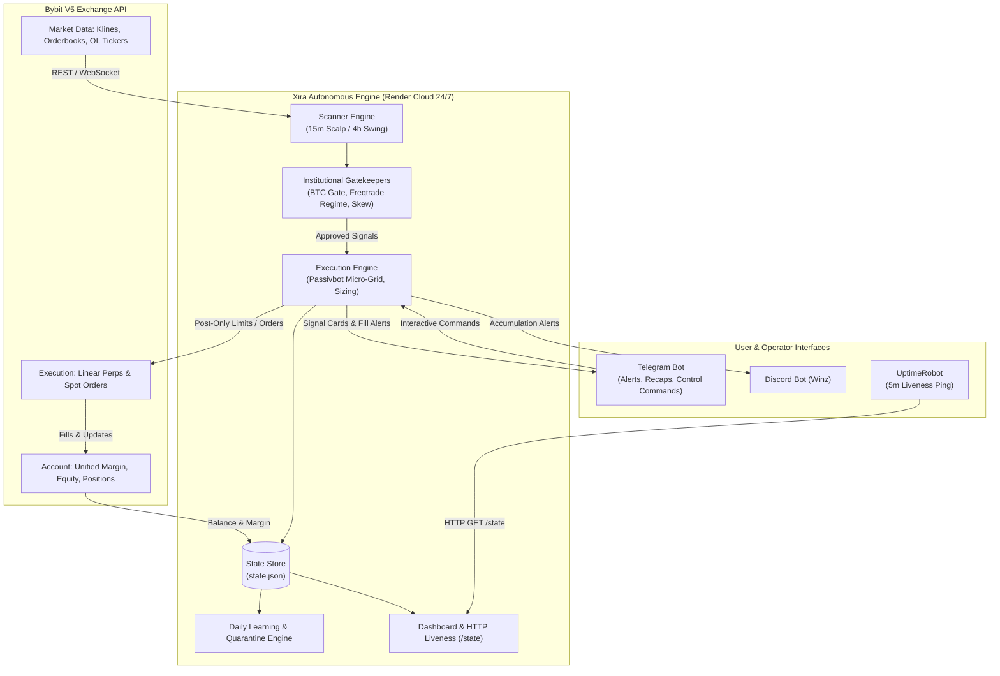
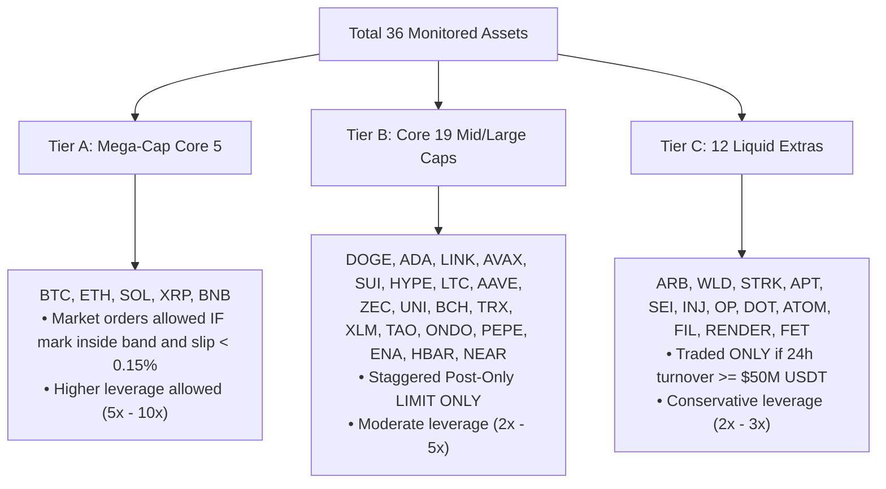
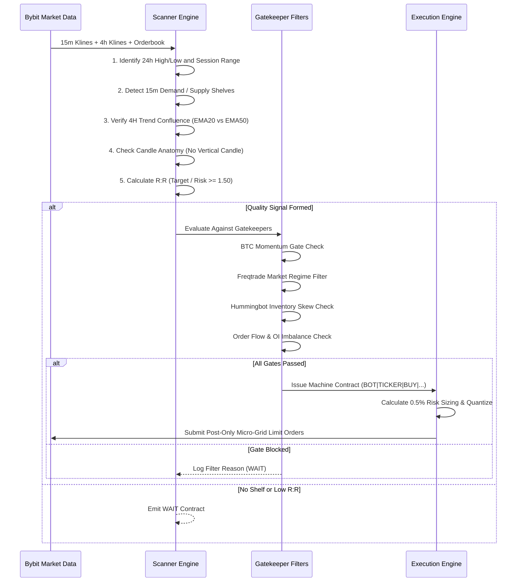
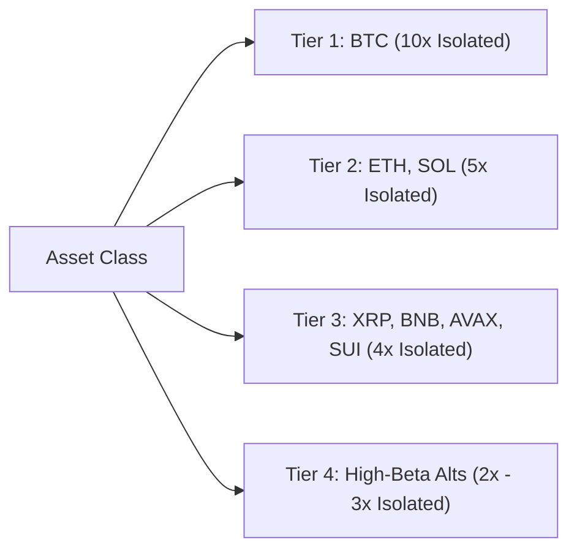
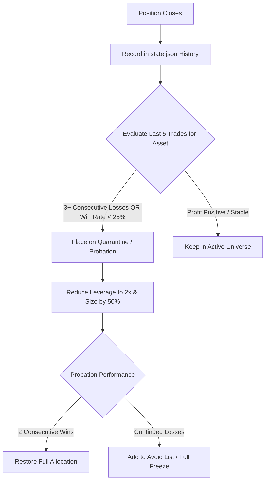

# Xira Autonomous Trade Desk — Complete System Manual & Architecture Guide

**Version**: 2.5 (Production V5)  
**Target Exchange**: Bybit V5 (Unified Trading Account — Linear USDT Perps & Spot)  
**Runtime**: Python 3.11+ / Cloud Deployment (Render 24/7)  
**Monitored Universe**: Core 24 Cryptocurrencies + Liquid Extras (36 Total)  
**Risk Policy**: Strict 0.5% Account Balance Risk per Trade | $R:R \ge 1.50$  

---

## Table of Contents
1. [Executive Summary & Core Philosophy](#1-executive-summary--core-philosophy)
2. [High-Level Architecture & Cloud Topology](#2-high-level-architecture--cloud-topology)
3. [Ticker Universe & Asset Hierarchy](#3-ticker-universe--asset-hierarchy)
4. [Signal Generation & Market Structure Engine](#4-signal-generation--market-structure-engine)
5. [Institutional Gatekeepers & Risk Modules](#5-institutional-gatekeepers--risk-modules)
   - [BTC Momentum Gate (Knife-Catching Protection)](#51-btc-momentum-gate)
   - [Freqtrade Market Regime Filter](#52-freqtrade-market-regime-filter)
   - [Hummingbot Inventory Skew & Portfolio Balance](#53-hummingbot-inventory-skew)
   - [Passivbot Micro-Grid Order Staggering](#54-passivbot-micro-grid-order-staggering)
   - [Order Flow Imbalance & Open Interest Delta](#55-order-flow-imbalance--open-interest-delta)
   - [Order Book Liquidity Wall Front-Running](#56-order-book-liquidity-wall-front-running)
   - [Dynamic Kelly & High-Water Mark Volatility Sizing](#57-dynamic-kelly--volatility-sizing)
6. [Execution & Trade Management Engine](#6-execution--trade-management-engine)
   - [Post-Only Limit vs. Market Order Rules](#61-order-types--tier-rules)
   - [Isolated Margin & Dynamic Leverage Tiers](#62-isolated-margin--leverage)
   - [3-Tier Partial Scale-Out (TP1, TP2, TP3) & Break-Even Trailing](#63-profit-taking--stop-management)
   - [Unstucking Trailing Mechanism](#64-unstucking-trailing-mechanism)
7. [Self-Learning & Asset Quarantine Engine](#7-self-learning--asset-quarantine-engine)
8. [Telegram Bot Command Center & Alerting System](#8-telegram-bot-command-center)
9. [Configuration & Environment Variables (.env)](#9-configuration--environment-variables)
10. [Troubleshooting, Verification & FAQ](#10-troubleshooting-verification--faq)

---

## 1. Executive Summary & Core Philosophy

Xira is an institutional-grade, algorithmic trading system built specifically for Bybit V5 USDT-margined perpetual futures and spot accumulation. The bot operates on four unyielding principles:

1. **Capital Preservation Above All Else**: Every position sizes strictly to risk exactly **0.5% of total equity** at the stop-loss price. No single trade can ever jeopardize more than 1% of account equity under any circumstances.
2. **Maker Over Taker (Zero Slippage Preference)**: Whenever possible, orders are entered via **Post-Only limit orders** to capture maker fee rebates and eliminate retail taker slippage.
3. **Multi-Model Consensus**: A trade signal is never executed purely on an oscillator. It must pass 4-hour trend confluence, 15-minute shelf detection, orderbook depth checks, Freqtrade regime filters, Hummingbot inventory skews, and Bitcoin momentum gates.
4. **24/7 Autonomous Reliability**: Deployed on containerized cloud infrastructure with automatic failover endpoints (`api.bybit.com` $\leftrightarrow$ `api.bytick.com`), background schedulers, resilient DNS fallback, and persistent state storage.

---

## 2. High-Level Architecture & Cloud Topology



### Key Components:
- **`main.py`**: Central orchestrator. Initializes the APScheduler background jobs, starts the local dashboard HTTP server, binds signal handlers, and triggers scalp (every 5m) and day (every 30m) scan cycles.
- **`scanner.py`**: Pure technical and quantitative analysis. Detects session swing shelves, evaluates vertical candle filters, calculates $R:R$, and constructs machine executor contracts (`BOT|TICKER|...`).
- **`engine.py`**: The execution broker. Computes 0.5% risk position size, performs Bybit lot/tick quantization, places Passivbot micro-grid entries, attaches TP/SL, and monitors open positions.
- **`bybit_client.py`**: Resilient REST client with HMAC SHA256 signing, public DNS fallback (bypassing ISP blocks), and automatic host failover between `api.bybit.com`, `api.bytick.com`, and `api-demo.bybit.com`.
- **`state.py`**: Thread-safe persistent JSON database managing active orders, realized PnL, quarantine lists, and high-water mark equity.
- **`telegram_bot.py`**: Two-way interactive bot allowing full control via commands like `/status`, `/recap`, `/reset`, `/pause`, `/resume`, `/avoid`, and `/leverage`.
- **`notifier.py`**: Clean, emoji-free Telegram card generator formatting signals, fill notices, and PnL recaps with markdown escaping.

---

## 3. Ticker Universe & Asset Hierarchy

Xira monitors 36 cryptocurrency pairs, categorized into three distinct operational tiers:



### Sector Basket Classification
To prevent over-exposure to single ecosystem crashes, assets are mapped into thematic baskets:
- **Layer 1**: BTC, ETH, SOL, ADA, AVAX, SUI, NEAR, BNB, TRX, BCH, LTC
- **DeFi / DEX**: UNI, AAVE, ENA, ONDO, LINK
- **Meme**: DOGE, PEPE
- **AI / Compute**: TAO, RENDER, FET, WLD
- **Payments / Privacy**: XRP, XLM, ZEC
- **Layer 2**: ARB, OP, STRK

> [!IMPORTANT]
> **Sector Cap Rule**: Maximum **2 active positions per sector**. If Xira holds active Longs in SOL and SUI, any subsequent Layer-1 buy signal (e.g. AVAX or NEAR) is automatically blocked.

---

## 4. Signal Generation & Market Structure Engine

Signals are generated through structural price action combined with higher-timeframe confluence:



### 1. Shelf Detection Algorithm
- **Demand Shelf (Support)**: Identified when a cluster of 15m candle lows consolidates within the bottom 30% of the session range without breaking lower, reinforced by a bullish wick rejection.
- **Supply Shelf (Resistance)**: Identified when candle highs cluster near the upper 30% of the session range with upper wick rejections.
- **Mid-Range Exclusion**: If price is sitting between 35% and 65% of the 24h range, the system outputs `WAIT` to avoid low-edge consolidation chop.

### 2. Vertical Candle Filter (No Chasing)
If the current 15m candle body exceeds **1.8%** of the asset's price, the candle is classified as `VERTICAL`. Market orders and aggressive limits are forbidden. Entering an extended candle invites immediate mean-reversion stop-outs.

### 3. Machine Executor Contract Format
All scan results compile into standardized, machine-parseable contract lines:
```text
BOT|TICKER|SIDE|MARKET|TIMEFRAME|ENTRY_LOW|ENTRY_HIGH|TP1|TP2|SL|LEVERAGE|RISK_PCT|EXPIRY|RULES
```
*Example*:
```text
BOT|ETH|BUY|PERP|15m|2704.57|2718.11|2753.36|2776.86|2694.61|5|0.005|2026-10-06 17:30 UTC|live mark inside or approaching band; funding not extreme against the side; 15m candle not vertical; book slip < 0.15% on BTC ETH SOL XRP BNB else cancel; never market PEPE TAO ENA HBAR NEAR
```

---

## 5. Institutional Gatekeepers & Risk Modules

Before any trade is routed to the exchange, it must pass through an institutional validation pipeline:

### 5.1. BTC Momentum Gate
- **Purpose**: Prevents "catching falling knives" on altcoins during Bitcoin flash crashes.
- **Logic**: Calculates Bitcoin's 30-minute rate of change ($\Delta\text{BTC}_{30\text{m}}$). If $\Delta\text{BTC}_{30\text{m}} < -0.40\%$, all altcoin **LONG** signals are immediately frozen. Conversely, if $\Delta\text{BTC}_{30\text{m}} > +0.70\%$, counter-trend altcoin **SHORTS** are blocked.

### 5.2. Freqtrade Market Regime Filter
- **Purpose**: Prevents fighting strong macro momentum.
- **Classification**:
  - `STRONG_BULL`: 4H EMA20 > EMA50, ADX $\ge 25$, slope positive $\rightarrow$ **Only Longs Allowed** (Shorts strictly blocked).
  - `STRONG_BEAR`: 4H EMA20 < EMA50, ADX $\ge 25$, slope negative $\rightarrow$ **Only Shorts Allowed** (Longs strictly blocked).
  - `CHOP_RANGE`: ADX $< 20$ or conflicting indicators $\rightarrow$ Both sides permitted with tightened profit targets.

### 5.3. Hummingbot Inventory Skew & Portfolio Balance
- **Purpose**: Prevents holding a heavily one-sided, correlated directional basket.
- **Rules**:
  1. **Directional Count Cap**: Maximum **3 positions** in the same direction (e.g. 3 Longs) if 0 opposing positions exist.
  2. **Net Notional Exposure Cap**: When 2 or more positions are open, total directional notional exposure cannot exceed **65%** of portfolio value. If the portfolio is already 65% Long, any additional Long signal is rejected until an existing trade closes.

### 5.4. Passivbot Micro-Grid Order Staggering
- **Purpose**: Eliminates entry slippage and captures wick liquidity.
- **Mechanism**: Instead of submitting a single lump-sum limit order at the market, Xira splits the entry into **2 staggered Post-Only Limit Orders**:
  - **Limit Order 1 (50% Size)**: Placed at `Entry High` (captures immediate price touch).
  - **Limit Order 2 (50% Size)**: Placed at `Entry Low` (averages down at bottom of shelf).

### 5.5. Order Flow Imbalance & Open Interest Delta
- **Order Flow**: Evaluates the top 25 levels of the L2 order book.
  - Bid/Ask Ratio $\ge 0.58$: `BID_HEAVY` (Supportive for Longs).
  - Bid/Ask Ratio $\le 0.42$: `ASK_HEAVY` (Supportive for Shorts).
- **Open Interest ($\Delta\text{OI}_{15\text{m}}$)**:
  - If price surges while OI drops significantly ($> 1\%$), flag as **Liquidation Short Squeeze** (avoids buying the exhaustion top).
  - If price breaks a shelf with stagnant OI, flag as **Fakeout Trap**.

### 5.6. Order Book Liquidity Wall Front-Running
- When setting Take-Profit targets, Xira scans the orderbook for massive limit walls ($\ge 2.5\times$ average level size).
- If a wall is located within 1.5% of the target, Xira automatically sets the TP **0.05% inside the wall**, guaranteeing fill execution before the orderbook rejects price.

### 5.7. Dynamic Kelly & High-Water Mark Volatility Sizing
- Baseline risk: **0.50%** ($0.005$) of equity.
- **A+ Conviction Setup** ($\ge 90\%$ conviction): Scales risk to **0.70%** ($0.007$).
- **Weekend Chop** (Saturday/Sunday UTC): Scales risk down to **0.30%** ($0.003$).
- **High-Water Mark (HWM) Drawdown Circuit**: If account equity experiences a $> 5\%$ drawdown from peak, leverage tiers are automatically reduced by 25% until equity reaches new highs.

---

## 6. Execution & Trade Management Engine

### 6.1. Order Types & Tier Rules
- **Post-Only Limit (Default for 95% of trades)**: The order is placed on the order book as a maker order (`timeInForce: PostOnly`). If the market moves so fast that the order would execute as a taker, Bybit automatically rejects/cancels the order rather than charging a high taker fee.
- **Market Order Exception (Tier A Only)**: Allowed **ONLY** on BTC, ETH, SOL, XRP, and BNB if:
  1. Current mark price is already inside the printed entry band.
  2. Orderbook spread and depth slippage is $< 0.15\%$.
- **Hard Ban on Market Orders**: **NEVER** use market orders on `PEPE`, `TAO`, `ENA`, `HBAR`, `NEAR`, or on any vertical 15m candle.

### 6.2. Isolated Margin & Leverage Tiers
Every trade uses **Isolated Margin** (`tradeMode: 1`). Under no circumstances is Cross Margin allowed, preventing cross-collateral liquidation risk.



### 6.3. Profit Taking & Stop Management
- **Take Profit 1 (TP1)**: Set at $1.5\times$ risk distance. When hit:
  - Closes **50% of the position** to lock in profit.
  - Automatically moves the Stop Loss on the remaining 50% to **Break-Even (Entry Price)**.
- **Take Profit 2 (TP2)**: Set at structural resistance/support ($2.5\times$ risk distance). Closes an additional **30% of the original position**.
- **Take Profit 3 (TP3 / Runner)**: Remaining 20% trails using a multi-step ratchet trail until reversed.

### 6.4. Unstucking Trailing Mechanism
If a position remains open for longer than **90 minutes** without hitting TP1 or SL, and is floating in modest profit ($> 0.3\%$), Xira's Passivbot unstucking module automatically trails the Stop Loss to **Break-Even**, freeing up margin capital for fresher opportunities.

---

## 7. Self-Learning & Asset Quarantine Engine

Xira actively adapts to changing market conditions through an automated feedback loop:



- **Daily Recap Audit (11:59 AM UTC)**: Automatically generates an end-of-day analytics audit computing Sharpe ratio, profit factor, win rate, and sector exposure.
- **Quarantined Assets**: Placed in probation mode. Position sizes are halved and leverage capped at 2x until the model regains statistical edge on that specific token.

---

## 8. Telegram Bot Command Center

The Telegram interface provides complete real-time monitoring and override control:

| Command | Action / Response |
| :--- | :--- |
| `/status` | Live dashboard: open positions, unrealized PnL, session win/loss, margin usage. |
| `/recap` | Instant trading recap: win rate, total PnL, profit factor, active drawdowns. |
| `/report` | Full desk publication across all 24 core tickers with TradingView links. |
| `/pause` | Immediately halts all new automated order executions (existing positions remain managed). |
| `/resume` | Resumes automated scanning and execution. |
| `/reset` | Resets paper equity baseline and flushes trade session statistics. |
| `/avoid <TICKER>` | Manually blacklists a token from trade execution (e.g. `/avoid DOGE`). |
| `/allow <TICKER>` | Removes a token from the blacklist. |
| `/quarantine` | Lists assets currently placed on probation or risk reduction. |
| `/leverage <TICKER> <N>` | Manually overrides leverage tier for a specific asset (e.g. `/leverage BTC 15`). |
| `/derisk` | Immediately moves Stop Loss on all open positions to Break-Even. |
| `/spot` | Displays spot accumulation trade recommendations. |
| `/onspot` / `/offspot` | Enables or disables automated spot order execution. |

---

## 9. Configuration & Environment Variables (.env)

The system is configured via environment variables. Below is the complete specification:

```ini
# ── Bybit Live API Keys ──
BYBIT_API_KEY=your_live_api_key_here
BYBIT_SECRET_KEY=your_live_api_secret_here

# ── Bybit Demo Trading / Testnet Keys ──
BYBIT_TESTNET_API_KEY=dfSFYQVvg4XLNapzaa
BYBIT_TESTNET_API_SECRET=TPGLzAlwYA9gpAxORz4Vz4XwJLdPXJXMMWpj

# ── Operational Mode ──
# "demo" = Bybit Demo Trading (https://api-demo.bybit.com) or Paper
# "live" = Real Bybit Mainnet (https://api.bybit.com)
TRADE_MODE=demo
DEMO_ENV=demo

# ── Telegram Alerting ──
TELEGRAM_BOT_TOKEN=8891297372:AAGcfBPqwtMtGdySj1DHhlz1GKs-yv25VLY
TELEGRAM_CHAT_ID=6724880386
FEEDBACK_BOT_TOKEN=8879075755:AAH917nfrbNLdQSP4WRqen0vWw8DoK0QH1g
FEEDBACK_CHAT_ID=6724880386

# ── Risk Parameters ──
RISK_PER_TRADE=0.005           # 0.5% risk per trade
PAPER_EQUITY=50000            # Starting paper equity
MAX_CONCURRENT_POSITIONS=6     # Maximum simultaneous open positions
MAX_POSITION_NOTIONAL=25000.0  # Max dollar size per position
MIN_FREE_MARGIN_PCT=0.30       # Maintain 30% available margin buffer

# ── Scanning Intervals (Seconds) ──
SCALP_TF=15
DAY_TF=4
SCAN_INTERVAL_SCALP=300        # Scan every 5 minutes
SCAN_INTERVAL_DAY=1800         # Scan every 30 minutes
DESK_SUMMARY_INTERVAL=60       # Push hourly recap every 60 minutes
```

---

## 10. Troubleshooting, Verification & FAQ

### Q1: Why do my orders show under "Current Orders" instead of "Positions" on Bybit?
**Answer**: Xira submits **Post-Only Limit Orders** to avoid paying high taker fees. A limit order sits under **Current Orders / Open Orders** until the market price reaches your entry level and fills. Once filled, it automatically moves to **Positions**.

### Q2: How do I verify Bybit connection credentials?
Run the built-in diagnostic tool from the terminal:
```bash
python main.py --test-connection
```
This tests signature generation, validates IP permissions, fetches your wallet balance, and confirms order-placement privileges.

### Q3: How do I switch from Demo to Live trading?
1. Open your `.env` file (or Render Dashboard Environment Variables).
2. Set `TRADE_MODE=live`.
3. Fill in your real `BYBIT_API_KEY` and `BYBIT_SECRET_KEY`.
4. Restart the bot / service.

### Q4: How is 24/7 uptime maintained on Render's free tier?
Render free services hibernate if no HTTP requests are received for 15 minutes. Xira includes an integrated HTTP server (`_DashboardHandler`) serving `https://<your-render-url>/state`. By pointing **[UptimeRobot](https://uptimerobot.com)** to ping `/state` every 5 minutes, the container is kept permanently awake 24/7/365 without cost.
